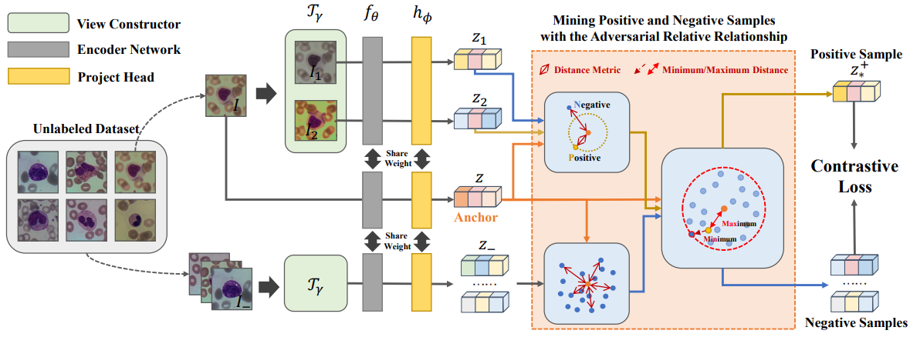

# ReCLR
 Leukocyte Classification Using Relative-Relationship-Guided Contrastive Learning

 P.S. SeCLR is marked HeCLR in the code.

 

  

# Unsupervised Train

Step 1: Open the train_unsupervised2.py file

Step 2: Ensure the dataset is set to Raabin-WBC in line 23

Step 3: Change the model to simclr in line 30

Step 4: Set the saved name to 1_6_pretrain in line 43

After it finishes running, change the dataset in line 23 to PBC, and keep lines 30 and 43 the same. The two 1_6_pretrain models will be saved in different folders.

# Linear Evaluation

Step 1: Open train_linear_evaluation.py

Step 2: In line 28, the dataset is set to Raabin-WBC

Step 3: In line 33, the method is set to simclr

Step 4: In line 38, the weight path is set to ./checkpoint/simclr/Raabin-WBC/1_6_pretrain/simclr_Raabin-WBC_conv4_seed_1024_epoch_200.tar

Step 5: In line 41, set save_file to 3_6_linear

Step 6: In line 43, set finetune to False

# Fine Tuning

Step 1: Open train_linear_evaluation.py

Step 2: In line 28, the dataset is set to Raabin-WBC

Step 3: In line 33, the method is set to simclr

Step 4: In line 38, the weight path is set to ./checkpoint/simclr/Raabin-WBC/1_6_pretrain/simclr_Raabin-WBC_conv4_seed_1024_epoch_200.tar

Step 5: In line 41, set save_file to 6_6_finetune

Step 6: In line 43, set finetune to True

# Domain Transfer (A2B/B2A)

PBC → Raabin-WBC

Step 1: Open the train_linear_evaluation.py file

Step 2: Ensure the dataset is set to Raabin-WBC in line 23

Step 3: Change the model to simclr in line 30

Step 4: Set the weight path in line 38 to ./checkpoint/simclr/PBC/1_6_pretrain/simclr_PBC_conv4_seed_1024_epoch_200.tar

Step 5: Set save_file to 9_6_transfer in line 41

Step 6: Set finetune to False in line 43

Step 7: Run train_linear_evaluation.py

Raabin-WBC → PBC

Step 1: Open the train_linear_evaluation.py file

Step 2: Ensure the dataset is set to PBC in line 23

Step 3: Change the model to simclr in line 30

Step 4: Set the weight path in line 38 to ./checkpoint/simclr/Raabin-WBC/1_6_pretrain/simclr_Raabin-WBC_conv4_seed_1024_epoch_200.tar

Step 5: Set save_file to 9_6_transfer in line 41

Step 6: Set finetune to False in line 43

Step 7: Run train_linear_evaluation.py

# Datasets
The PBC dataset can be found at the this [paper] ([https://arxiv.org/abs/2405.14506](https://upcommons.upc.edu/handle/2117/386919)).

<!--[Peripheral Blood Cell](https://upcommons.upc.edu/handle/2117/386919)

[BCISC 1K](https://onlinelibrary.wiley.com/doi/full/10.1002/jbio.201800488?casa_token=Ty3FnmjW58MAAAAA%3Aj7uCHu7Jk3tTUnUjnOA_NJomSAjQtfZm8Q0-W-Br1j7Sfvvg5aNlxoq8pspL4wY8Rd4Ds4GSY0UISpg) -->
